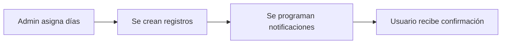

# Sistema de Notificaciones de Ayuno

Este sistema permite que los usuarios reciban notificaciones push a las 8pm del día anterior para confirmar que van a ayunar, y mantiene un registro completo de sus ayunos.

## 🚀 Funcionalidades Implementadas

### ✅ Notificaciones Automáticas
- **Confirmación**: Se envía a las 8pm del día anterior al ayuno
- **Recordatorio**: Se envía a las 6am del día del ayuno
- **Feedback**: Notificaciones inmediatas cuando se confirma o completa un ayuno

### ✅ Registro Completo
- **Días asignados**: Se guardan todos los días que el usuario va a ayunar
- **Confirmaciones**: Se registra cuándo el usuario confirma que va a ayunar
- **Ayunos completados**: Se guardan las veces que el usuario confirmó que ayunó
- **Notas**: El usuario puede agregar notas sobre su experiencia
- **Estadísticas**: Porcentajes de completado, fechas, etc.

## 📱 Componentes del Sistema

### 1. Modelos de Datos

#### `UserFastingRecord`
```dart
class UserFastingRecord {
  final String id;
  final String userId;
  final String fastingId;
  final String dia; // lunes, martes, etc.
  final DateTime fechaAyuno; // fecha específica del ayuno
  final bool confirmoParticipacion; // confirmó que va a ayunar
  final DateTime? fechaConfirmacion; // cuándo confirmó
  final bool completoAyuno; // confirmó que ayunó
  final DateTime? fechaCompletado; // cuándo confirmó que ayunó
  final String? notasUsuario; // notas adicionales
}
```

#### `UserFastingStats`
```dart
class UserFastingStats {
  final int totalDiasAsignados;
  final int diasConfirmados;
  final int diasCompletados;
  final double porcentajeCompletado;
  final DateTime? ultimaConfirmacion;
  final DateTime? ultimoAyunoCompletado;
}
```

### 2. Servicios

#### `LocalNotificationService`
- Maneja notificaciones locales programadas
- Programa notificaciones a horas específicas
- Maneja acciones cuando se presionan las notificaciones

#### `FastingRecordService`
- Gestiona los registros de ayuno del usuario
- Coordina con las notificaciones
- Proporciona estadísticas

#### `FastingIntegrationService`
- Servicio de nivel superior que conecta todo
- Proporciona métodos fáciles de usar
- Incluye ejemplos de uso

## 🛠️ Cómo Usar el Sistema

### 1. Asignar Usuario a un Ayuno

```dart
import 'package:eventos_cruz_de_cristal/core/services/fasting_integration_service.dart';

// Cuando un usuario se registra para ayunar ciertos días
await FastingIntegrationService.assignUserToFasting(
  userId: 'user_123',
  ayuno: ayunoModel, // Tu modelo de ayuno existente
  diasAsignados: ['lunes', 'miercoles', 'viernes'],
);
```

**¿Qué hace esto?**
- Crea registros para cada día asignado
- Programa notificación a las 8pm del día anterior (confirmación)
- Programa notificación a las 6am del día del ayuno (recordatorio)
- Muestra notificación inmediata de confirmación de asignación

### 2. Manejar Confirmación de Ayuno

```dart
// Cuando el usuario confirma que va a ayunar (desde notificación o app)
final confirmed = await FastingIntegrationService.handleFastingConfirmation(
  userId: 'user_123',
  fastingId: 'fasting_456',
  dia: 'lunes',
);

if (confirmed != null) {
  print('Confirmación exitosa');
}
```

### 3. Marcar Ayuno como Completado

```dart
// Cuando el usuario confirma que completó su ayuno
final completed = await FastingIntegrationService.handleFastingCompletion(
  userId: 'user_123',
  fastingId: 'fasting_456',
  dia: 'lunes',
  notas: 'Fue una experiencia muy enriquecedora',
);
```

### 4. Obtener Estadísticas

```dart
// Para mostrar progreso del usuario
final stats = await FastingIntegrationService.getUserStats(
  userId: 'user_123',
  fastingId: 'fasting_456',
);

print('Completado: ${stats.porcentajeCompletado}%');
print('Días confirmados: ${stats.diasConfirmados}/${stats.totalDiasAsignados}');
```

### 5. Usar la Pantalla de Confirmación

```dart
import 'package:eventos_cruz_de_cristal/features/fasting/presentation/screens/screens.dart';

// Navegar a la pantalla de gestión de ayunos
Navigator.push(
  context,
  MaterialPageRoute(
    builder: (context) => const FastingConfirmationScreen(),
  ),
);
```

## 📋 Flujo Completo del Usuario

### 1. Asignación Inicial


### 2. Día Anterior (8pm)


### 3. Día del Ayuno (6am)


## 🎯 Integración en tu App

### 1. Inicialización en main.dart
Ya está configurado:
```dart
void main() async {
  WidgetsFlutterBinding.ensureInitialized();
  
  // Inicializar notificaciones locales
  await LocalNotificationService.initialize();
  
  runApp(const MyApp());
}
```

### 2. Manejo de Notificaciones Presionadas

En tu `LocalNotificationService`, puedes personalizar el manejo:

```dart
static void _onNotificationTap(NotificationResponse response) {
  if (response.payload != null) {
    // Usar el servicio de integración para manejar el payload
    FastingIntegrationService.handleNotificationPayload(response.payload!);
  }
}
```

### 3. Integrar con tu Sistema de Usuarios

```dart
// En lugar de 'user_123', usar tu sistema real de autenticación
final currentUser = await AuthService.getCurrentUser();
final userId = currentUser.id;

await FastingIntegrationService.assignUserToFasting(
  userId: userId,
  ayuno: ayuno,
  diasAsignados: diasSeleccionados,
);
```

## 📊 Monitoreo y Estadísticas

### Obtener Registros Pendientes
```dart
final pending = await FastingRecordService.getPendingConfirmationsForToday(userId);
print('Confirmaciones pendientes: ${pending.length}');
```

### Obtener Ayunos de Hoy
```dart
final today = await FastingRecordService.getTodaysFastings(userId);
print('Ayunos de hoy: ${today.length}');
```

### Sincronizar Notificaciones
```dart
// Llamar al iniciar la app o después de cambios
await FastingIntegrationService.syncNotifications(userId);
```

## 🛡️ Consideraciones de Seguridad y Rendimiento

### Almacenamiento Local
- Los datos se guardan usando `SharedPreferences`
- Para producción, considera usar una base de datos más robusta
- Los datos están vinculados al usuario por `userId`

### Notificaciones
- Las notificaciones se programan usando `flutter_local_notifications`
- Se cancelan automáticamente cuando se cancela la participación
- Incluyen IDs únicos para evitar conflictos

### Manejo de Errores
- Todos los servicios incluyen manejo robusto de errores
- Los errores se logean en modo debug
- Las operaciones fallan graciosamente

## 🧪 Testing y Desarrollo

### Limpiar Datos de Prueba
```dart
// ⚠️ Elimina TODOS los registros - solo usar en desarrollo
await FastingIntegrationService.resetAllData();
```

### Ver Notificaciones Pendientes
```dart
final pending = await LocalNotificationService.getPendingNotifications();
print('Notificaciones programadas: ${pending.length}');
```

### Probar con Fechas Futuras
```dart
// Para testing, puedes crear ayunos con fechas específicas
final ayunoTest = FastingModel(
  id: 'test_fasting',
  titulo: 'Ayuno de Prueba',
  descripcion: 'Para testing',
  fechaInicio: DateTime.now().add(Duration(days: 1)),
  fechaFin: DateTime.now().add(Duration(days: 7)),
  iglesiaId: 'iglesia_test',
  createdAt: DateTime.now(),
);
```

## 📝 Dependencias Agregadas

En `pubspec.yaml` se agregaron:
```yaml
dependencies:
  flutter_local_notifications: ^17.2.1+2
  timezone: ^0.9.2
```

## 🔄 Próximos Pasos Sugeridos

1. **Integrar con Firebase**: Para sincronización entre dispositivos
2. **Push Notifications**: Además de las locales, usar Firebase Cloud Messaging
3. **Base de Datos**: Migrar de SharedPreferences a SQLite o Firebase
4. **Reportes**: Crear pantallas de estadísticas para administradores
5. **Configuración**: Permitir a usuarios personalizar horarios de notificaciones

## 📞 Ayuda y Soporte

Si necesitas ayuda con la implementación:

1. Revisa los logs en modo debug
2. Verifica que las notificaciones estén habilitadas en el dispositivo
3. Asegúrate de que las fechas de ayuno sean futuras
4. Usa `FastingIntegrationService.resetAllData()` para limpiar datos de prueba

¡El sistema está listo para usar! 🙏 